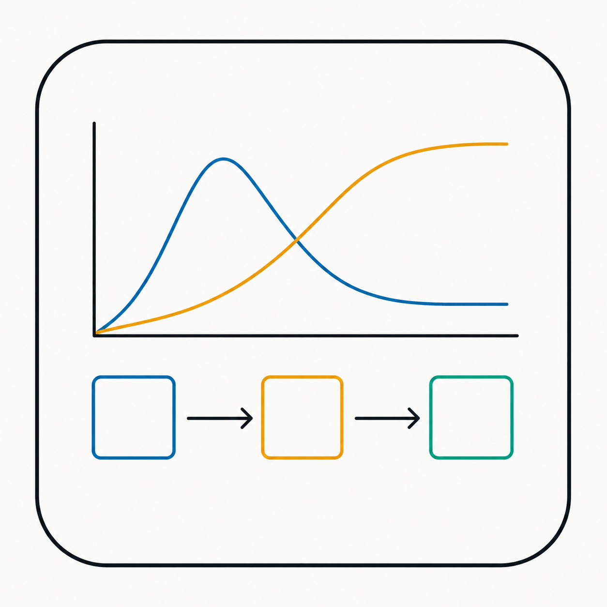
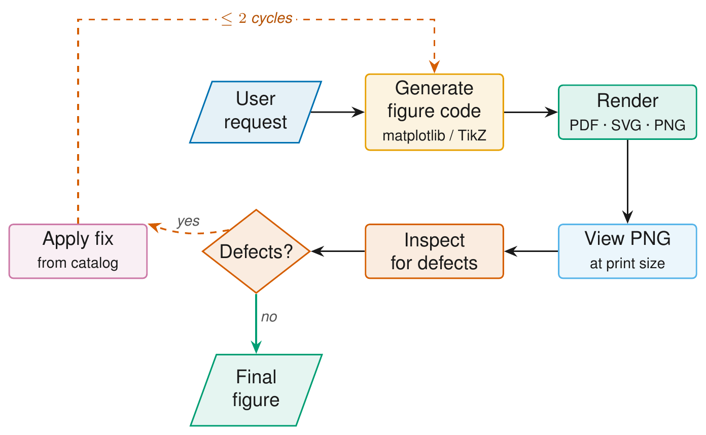

<p align="center">
    
</p>

<h1 align="center">figura</h1>

<p align="center">
    <i align="center">Publication-quality figures, plots, and diagrams for academic papers — render → view → fix until print-size defects are gone 🧪</i>
</p>

<h4 align="center">
  <a href="https://opensource.org/licenses/MIT">
    
  </a>
  <a href="https://docs.claude.com/en/docs/claude-code/overview">
    
  </a>
  <a href="https://www.latex-project.org/">
    
  </a>
  <a href="#">
    
  </a>
</h4>

<p align="center">
    
</p>


## Introduction

`figura` enables you to produce paper-ready figures, plots, and diagrams without falling into the "default matplotlib" or "default TikZ" look that gives away a rushed submission.

It ships as a [Claude Code](https://docs.claude.com/en/docs/claude-code/overview) plugin: an auto-triggering skill plus four slash commands that run the same render → view → fix loop on every figure. The skill knows how to inspect a rendered PNG at print resolution, find user-visible defects, and apply standard fixes from a defect catalog — capped at two cycles so you don't chase pixels.

Two backends sit behind one workflow: **matplotlib** (`.py`) for data plots and **TikZ / LaTeX** (`.tex`) for diagrams that match a paper's body typography. Same Okabe-Ito colorblind-safe palette, same Helvetica defaults, same export pipeline.

<details open>
<summary>
 Features
</summary> <br />

- **Render → view → fix loop, capped at two cycles.** First-pass renders almost always have at least one user-visible defect (small fonts, legend overlap, tick collision, arrow-through-text). The plugin views the rendered PNG at 300 DPI scaled to print size, names defects from a catalog, and applies standard fixes.
- **matplotlib pipeline that matches Nature / NeurIPS / IEEE house style.** Embedded TrueType fonts (`pdf.fonttype = 42`), Helvetica + `stixsans` math, top/right spines off, Okabe-Ito categorical palette, perceptually uniform colormaps, print-size figure dimensions. `export.save()` emits PDF + SVG + PNG atomically.
- **TikZ standalone diagrams that drop straight into a LaTeX paper.** `\documentclass[tikz,border=4pt]{standalone}`, the same Okabe-Ito hex codes as the matplotlib palette, reusable `stage` / `decision` / `io` styles, build helper that compiles to PDF and a 300 DPI PNG preview for the iteration loop.
- **Defect catalog covering both backends.** matplotlib: tick collisions, legend covering data, multi-panel cramping, panel labels clipped. TikZ: arrow-through-diamond-text, loop-arrow-crossing-rows, label-on-top-of-node — each with copy-paste fix snippets.
- **Four slash commands that dispatch on extension.** `/figura:iterate`, `/figura:beautify`, `/figura:fix-overlap`, `/figura:analyze-image`. `.py` → matplotlib branch. `.tex` → TikZ branch.

</details>


## Usage

The fastest path is the Claude Code marketplace. Inside Claude Code:

```text
/plugin marketplace add chrischoy/figura
/plugin install figura@figura
/reload-plugins
```

Then, in any project:

```text
Make a publication-quality 3D plot of a torus
```

Claude renders `figures/fig_torus.{pdf,svg,png}`, views the PNG, and verifies legibility at print size before declaring the figure done. The matching script lives at `skills/figura/examples/torus.py`.

For a TikZ diagram:

```text
Make a TikZ flowchart of an encoder → decoder pipeline
```

`figures/<name>.{pdf,png}` (and `.svg` if `pdf2svg` is installed). Template: `skills/figura/examples/diagram_flow.tex`.

The skill also auto-triggers on phrases like *"figure for my paper"*, *"plot for the manuscript"*, *"architecture diagram"*, *"publication-quality"*, *"submission-quality figure"*, or any reference to LaTeX, NeurIPS, ICML, ICLR, IEEE, ACM, Nature, Science, or arXiv.

<details>
<summary>
  Slash commands
</summary> <br />

All four commands dispatch on file extension: `.py` → matplotlib branch, `.tex` → TikZ branch.

| Command | What it does |
|---------|--------------|
| `/figura:iterate <script.py \| diagram.tex>` | Runs the render → view → fix loop. Caps at two cycles. |
| `/figura:beautify <script.py \| diagram.tex>` | Upgrades a "default-looking" figure to publication style (fonts, palette, spines / borders, vector export). |
| `/figura:fix-overlap <script.py \| diagram.tex>` | Targeted collision fixer — tick labels & legend (matplotlib) or arrow-through-text & loop-arrow-crossing-nodes (TikZ). |
| `/figura:analyze-image <image.png \| .pdf>` | Read-only visual audit. Reports defects by category and severity; does not modify anything. |

</details>

<details>
<summary>
  Manual install (without the marketplace)
</summary> <br />

```bash
git clone https://github.com/chrischoy/figura ~/.claude/skills/figura-src
ln -s ~/.claude/skills/figura-src/skills/figura ~/.claude/skills/figura
/reload-skills
```

</details>


## Development

Alternatively, instead of using `figura` exclusively through Claude Code, the underlying scripts and TikZ helpers can be invoked directly — useful for one-off figures, CI builds, or contributions. If contributing, please refer to the [contributing](#contributing_anchor) section.

<details open>
<summary>
Pre-requisites
</summary> <br />

To be able to use figura locally, make sure that you have the following installed:

###

- Python 3.9+
- TeX Live or MacTeX (for the TikZ branch)
- `pdftoppm` (`brew install poppler` / `apt install poppler-utils`) — PNG previews
- `pdf2svg` *(optional)* — emits an SVG alongside the PDF
- Graphviz *(optional, for graphviz diagrams)* — `brew install graphviz` / `apt install graphviz`

</details>

<details open>
<summary>
Running figura locally
</summary> <br />

> **Note**
> Claude Code does not manage Python. Install dependencies in your host environment (system, venv, or conda — your choice).

1. Clone the repository and install dependencies:
   ```bash
   git clone https://github.com/chrischoy/figura.git && cd figura
   pip install -r requirements.txt
   pip install -r requirements-extras.txt   # optional
   ```

2. Render a matplotlib figure:
   ```python
   import sys
   sys.path.insert(0, "skills/figura/scripts")

   import matplotlib
   matplotlib.use("Agg")
   import matplotlib.pyplot as plt
   import pubstyle, colors, export

   pubstyle.apply()
   colors.apply_cycle()

   fig, ax = plt.subplots(figsize=pubstyle.figsize("single"))
   ax.plot([1, 2, 3], [1, 4, 2])
   ax.set_xlabel("x"); ax.set_ylabel("y")

   export.save(fig, "fig_demo")    # writes ./figures/fig_demo.{pdf,svg,png}
   ```

3. Render a TikZ diagram:
   ```bash
   cp skills/figura/examples/diagram_flow.tex figures/my_fig.tex
   # edit nodes / edges
   bash skills/figura/scripts/tikz_build.sh figures/my_fig.tex figures
   # writes figures/my_fig.{pdf,png} — view the PNG, iterate
   ```

   In your paper:
   ```latex
   \includegraphics[width=\columnwidth]{figures/my_fig}
   ```

4. Venue-specific defaults: `pubstyle.apply(venue="ieee")` (also `neurips`, `icml`, `iclr`, `acm`, `nature`).

5. Engine override for TikZ: `TIKZ_ENGINE=lualatex bash skills/figura/scripts/tikz_build.sh ...`.

</details>

<details>
<summary>
Repository layout
</summary> <br />

```text
.claude-plugin/
  marketplace.json           single-plugin marketplace
  plugin.json                plugin metadata
commands/
  iterate.md                 /figura:iterate          render → view → fix
  beautify.md                /figura:beautify         upgrade to pub style
  fix-overlap.md             /figura:fix-overlap      targeted collision fix
  analyze-image.md           /figura:analyze-image    read-only audit
skills/
  figura/
    SKILL.md                 entry point; loaded into Claude's context
    scripts/
      pubstyle.py            publication rcParams (fonts, spines, vector-safe)
      colors.py              colorblind-safe palettes (Okabe-Ito, Tol Muted)
      export.py              atomic multi-format save (PDF + SVG + PNG)
      tikz_build.sh          pdflatex → 300 DPI PNG preview helper
    references/
      plots.md               line, bar, scatter, heatmap, violin, multi-panel,
                             histogram, ablation, 3D surface
      diagrams.md            matplotlib / graphviz / hand-SVG patterns
      tikz.md                TikZ template, build loop, defect catalog
      iteration.md           render → view → fix loop + defect catalog
      checklist.md           pre-submission QA
    examples/
      torus.py               runnable end-to-end 3D surface example
      diagram_flow.tex       runnable TikZ standalone flowchart template
    figures/                 example outputs (gitignored)
assets/
  figura-icon.png            project icon
  iteration_loop.png         README iteration-loop hero (PDF source-of-truth: figures/iteration_loop.tex)
  iteration_loop.pdf         vector copy of the iteration-loop hero
README.md
requirements.txt             core Python deps (host env, not Claude Code)
requirements-extras.txt      optional deps for diagram / SVG / scipy patterns
```

</details>


## Resources

- **[Claude Code](https://docs.claude.com/en/docs/claude-code/overview)** — the CLI / IDE harness this plugin runs in.
- **[Okabe-Ito palette](https://jfly.uni-koeln.de/color/)** — the colorblind-safe categorical palette baked into both backends.
- **[matplotlib](https://matplotlib.org/)** — the data-plot backend.
- **[TikZ & PGF manual](https://pgf-tikz.github.io/pgf/pgfmanual.pdf)** — the diagram backend.


<a name="contributing_anchor"></a>
## Contributing

`figura` is open-source and contributions are welcome — bug reports, defect-catalog entries, new venue styles, additional reference patterns. Please open an issue describing the change before opening a large PR.

- **Bug Report** — if a figure renders incorrectly or a slash command fails, open a [bug report](https://github.com/chrischoy/figura/issues/new) with the source script / `.tex` and the rendered PNG.
- **Feature Request** — if there's a paper aesthetic, venue style, or defect class that isn't covered, open a [feature request](https://github.com/chrischoy/figura/issues/new) with an example of the figure you're trying to produce.
- **New defect-catalog entry** — if you hit a render bug whose fix isn't in `references/iteration.md` or `references/tikz.md`, a PR adding the symptom, cause, and fix is the highest-leverage contribution.


## License

MIT.
