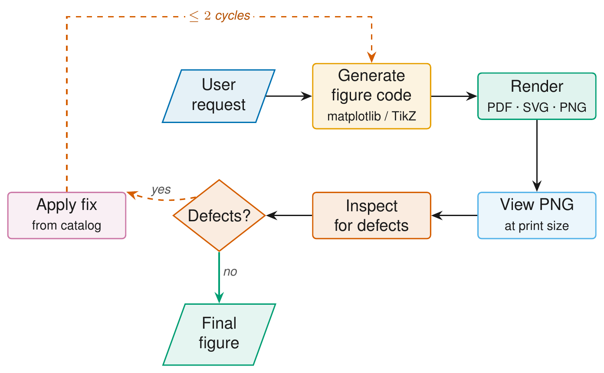

# figura

> **Publication-quality figures, plots, and diagrams for academic papers — with a render → view → fix loop that catches visual defects at print size.**

A Claude Code plugin. Works on **matplotlib** (`.py`) and **TikZ / LaTeX** (`.tex`) sources through a single shared iteration loop.

<p align="center">
  
</p>

---

## The iteration loop

Every figure goes through the same loop, regardless of backend. **Stop after at most two fix cycles** — figure work has a long tail of nitpicks readers never notice.

<p align="center">
  
</p>

The loop preview PNG is rendered at 300 DPI from a figure sized to the actual print dimensions, so on-screen pixels correspond directly to what a reader sees on paper. (This diagram itself was built with the TikZ branch — source at `figures/iteration_loop.tex`.)

---

## Install

```text
/plugin marketplace add chrischoy/figura
/plugin install figura@figura
/reload-plugins
```

Auto-triggers on phrases like *"figure for my paper"*, *"plot for the manuscript"*, *"architecture diagram"*, *"publication-quality"*, *"submission-quality figure"*, or any reference to LaTeX, NeurIPS, ICML, ICLR, IEEE, ACM, Nature, Science, or arXiv.

### Slash commands

All four commands dispatch on file extension: `.py` → matplotlib branch, `.tex` → TikZ branch.

| Command | What it does |
|---------|--------------|
| `/figura:iterate <script.py \| diagram.tex>` | Runs the render → view → fix loop. Caps at two cycles. |
| `/figura:beautify <script.py \| diagram.tex>` | Upgrades a "default-looking" figure to publication style (fonts, palette, spines / borders, vector export). |
| `/figura:fix-overlap <script.py \| diagram.tex>` | Targeted collision fixer — tick labels & legend (matplotlib) or arrow-through-text & loop-arrow-crossing-nodes (TikZ). |
| `/figura:analyze-image <image.png \| .pdf>` | Read-only visual audit. Reports defects by category and severity; does not modify anything. |

### Manual install

If you prefer to install by hand:

```bash
git clone https://github.com/chrischoy/figura ~/.claude/skills/figura-src
ln -s ~/.claude/skills/figura-src/skills/figura ~/.claude/skills/figura
/reload-skills
```

### Python deps (host environment)

Claude Code does not manage Python. Install from a clone — the plugin install path is implementation-defined.

```bash
git clone https://github.com/chrischoy/figura /tmp/figura
pip install -r /tmp/figura/requirements.txt
pip install -r /tmp/figura/requirements-extras.txt   # optional
```

### TikZ deps

For the TikZ branch (`/figura:* diagram.tex`):

- `pdflatex` (TeX Live or MacTeX). `lualatex` works too via `TIKZ_ENGINE=lualatex`.
- `pdftoppm` for PNG previews — `brew install poppler` / `apt install poppler-utils`.
- `pdf2svg` (optional) — emits an SVG alongside the PDF.

For graphviz diagrams: `brew install graphviz` / `apt install graphviz`.

---

## First run

Inside Claude Code:

```text
Make a publication-quality 3D plot of a torus
```

`figures/fig_torus.{pdf,svg,png}` lands in your working directory and Claude views the PNG to verify legibility at print size. Matching script: `skills/figura/examples/torus.py`.

For TikZ:

```text
Make a TikZ flowchart of an encoder → decoder pipeline
```

`figures/<name>.{pdf,png}` (and `.svg` if `pdf2svg` is installed). Template: `skills/figura/examples/diagram_flow.tex`.

---

## Quick start without Claude Code

### matplotlib

```python
import sys
sys.path.insert(0, "<path-to-repo>/skills/figura/scripts")

import matplotlib
matplotlib.use("Agg")
import matplotlib.pyplot as plt
import pubstyle, colors, export

pubstyle.apply()
colors.apply_cycle()

fig, ax = plt.subplots(figsize=pubstyle.figsize("single"))
ax.plot([1, 2, 3], [1, 4, 2])
ax.set_xlabel("x"); ax.set_ylabel("y")

export.save(fig, "fig_demo")    # writes ./figures/fig_demo.{pdf,svg,png}
```

Venue-specific defaults: `pubstyle.apply(venue="ieee")` (also `neurips`, `icml`, `iclr`, `acm`, `nature`).

### TikZ

```bash
cp skills/figura/examples/diagram_flow.tex figures/my_fig.tex
# edit nodes / edges
bash skills/figura/scripts/tikz_build.sh figures/my_fig.tex figures
# writes figures/my_fig.{pdf,png} — view the PNG, iterate
```

In your paper: `\includegraphics[width=\columnwidth]{figures/my_fig}`.

---

## What it fixes

Defaults that the upstream tools ship with are designed for screen exploration, not print. The skill fixes the most common "default" tells.

**matplotlib**

- Embedded TrueType fonts in PDFs (`pdf.fonttype = 42`) — journals reject Type 3.
- Helvetica/Arial body text + matching `stixsans` math glyphs.
- Top/right spines off, subtle ticks, no gridlines by default.
- Colorblind-safe categorical palette (Okabe-Ito) + perceptually uniform sequential (`viridis`/`cividis`) and diverging (`RdBu_r`) recommendations.
- Print-size figure dimensions baked into the helpers, so 8 pt fonts stay 8 pt.
- `export.save()` writes PDF + SVG + PNG together with `bbox_inches="tight"`, atomically (temp + replace), with path-traversal guard.

**TikZ**

- `\documentclass[tikz,border=4pt]{standalone}` so the diagram crops tight and `\includegraphics{}` cleanly.
- `\usepackage{helvet}` + sans-serif default — Helvetica matching the matplotlib pipeline, not Computer Modern serif.
- Okabe-Ito hex defs (`okBlue`, `okOrange`, …) — exact same palette as `scripts/colors.py`, so TikZ diagrams and matplotlib plots match.
- Reusable `stage` / `decision` / `io` styles defined once at the top of `tikzpicture`.
- Uniform `Stealth` arrowheads, `0.7pt` lines, `rounded corners=2pt`.
- `font=\small` so text stays readable when shrunk to `\columnwidth`.
- Defect catalog covering the bugs that always appear in the first render — arrow-through-diamond-text, loop-arrow-crossing-rows, label-on-top-of-node — with copy-paste fixes.

---

## Layout

```text
.claude-plugin/
  marketplace.json           single-plugin marketplace
  plugin.json                plugin metadata
commands/
  iterate.md                 /figura:iterate          render → view → fix
  beautify.md                /figura:beautify         upgrade to pub style
  fix-overlap.md             /figura:fix-overlap      targeted collision fix
  analyze-image.md           /figura:analyze-image    read-only audit
skills/
  figura/
    SKILL.md                 entry point; loaded into Claude's context
    scripts/
      pubstyle.py            publication rcParams (fonts, spines, vector-safe)
      colors.py              colorblind-safe palettes (Okabe-Ito, Tol Muted)
      export.py              atomic multi-format save (PDF + SVG + PNG)
      tikz_build.sh          pdflatex → 300 DPI PNG preview helper
    references/
      plots.md               line, bar, scatter, heatmap, violin, multi-panel,
                             histogram, ablation, 3D surface
      diagrams.md            matplotlib / graphviz / hand-SVG patterns
      tikz.md                TikZ template, build loop, defect catalog
      iteration.md           render → view → fix loop + defect catalog
      checklist.md           pre-submission QA
    examples/
      torus.py               runnable end-to-end 3D surface example
      diagram_flow.tex       runnable TikZ standalone flowchart template
    figures/                 example outputs (gitignored)
docs/
  torus.png                  README hero image
  iteration_loop.png         README iteration-loop diagram
README.md
requirements.txt             core Python deps (host env, not Claude Code)
requirements-extras.txt      optional deps for diagram / SVG / scipy patterns
```

---

## Generating a logo / icon for figura

For a project icon (favicon, plugin marketplace card, social preview), feed an image-generation model the prompt below. It encodes the same aesthetic the skill enforces — minimal, geometric, vector-friendly, colorblind-safe palette — so the icon visually matches the figures the plugin produces.

**Prompt (paste into Midjourney / DALL·E / Imagen / Ideogram / Recraft):**

```text
Minimal flat vector logo for "figura" — a tool for publication-quality
academic figures. A single rounded square containing a stylized line plot
(thin axes, two clean curves) overlaid with a small box-and-arrow node
flowchart hint, suggesting both data plots and diagrams. Geometric, clean,
print-friendly. Limited Okabe-Ito colorblind-safe palette: deep blue
(#0072B2), warm orange (#E69F00), bluish green (#009E73), dark ink black
(#1A1A1A) line work on a soft off-white background (#F8F8F5). No gradients,
no drop shadows, no 3D, no text, no skeumorphism. Flat 2D, hairline strokes,
generous negative space, sharp at small sizes. Square 1:1, centered,
trimmable to a circle. Style references: Stripe icons, Linear app icons,
Tailwind UI marks. SVG-aesthetic.
```

**Recommended settings**

- **Aspect ratio:** `1:1` square (most platforms crop to square or circle).
- **Output size:** at least 1024 × 1024 so the result downsamples cleanly to a 32 × 32 favicon.
- **Variants to ask for:** light-on-dark (`#1A1A1A` background, lighter Okabe-Ito strokes), and a single-color monochrome version for places that demand it (favicon fallbacks, OS dark-mode tinting).
- **Iteration:** if first round is too busy, ask for "even simpler — 2–3 strokes maximum, single accent color". Most logos benefit from one more pass of removal.
- **Vectorization:** rasterized output → run through [recraft.ai](https://recraft.ai) or `vtracer` to get an `.svg`. Final logo lives at `docs/logo.svg` (referenced from `plugin.json`).

**What to avoid**

- Anthropomorphic mascots, faces, hands, eyes — they fight a clean technical brand.
- Photorealism, gradients, glow, glass, beveling — the skill's whole anti-pattern list applies to the icon too.
- Including the literal word "figura" inside the mark — keep mark and wordmark separable so the favicon is just the mark.

---

## License

MIT.
